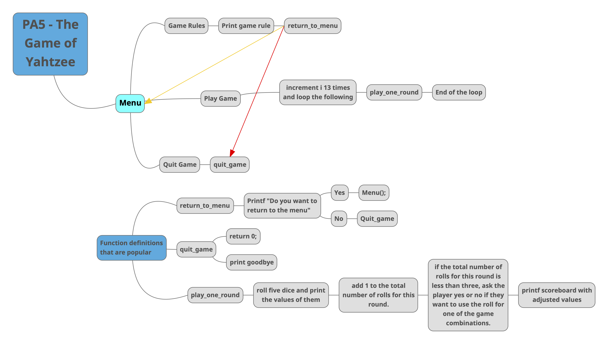

<h1 align="center">Classic Games</h1>

<p align="center">
  

  

  

  
</p>

<p align="center">


</p>

This project is a collection of three classic text-based games—Blackjack, Craps, and Yahtzee—developed in C. Each game is designed to run in the terminal, showcasing core game mechanics and a user-friendly interface. The project demonstrates modular programming practices, with each game organized into multiple C files to handle game logic, user interactions, and calculations.


<details>
<summary style="color:#5087dd">Watch the Full Video Demo Here</summary>

[](https://www.youtube.com/watch?v=VidKEY)

</details>

---


# Table of Contents
- [What I Learned](#what-i-learned-in-this-project)
- [Tools Used / Development Environment](#tools-used--development-environment)
- [Team / Contributors / Teachers](#team--contributors--teachers)
- [How to Set Up](#how-to-set-up)
- [Project Overview](#project-overview)
    - [BlackJack](#blackjack)
    - [Craps](#craps)
    - [Yahtzee](#yahtzee)
    - [Lessons Learned and Topics Covered](#lessons-learned-and-topics-covered)
    - [Future Work](#future-work)
- [Acknowledgments](#acknowledgments)

---

# What I Learned in this Project
- Programming fundamentals of C
- How to use arrays, pointers, structs, functions, and safe user input to create full program experiences.


# Tools Used / Development Environment
- C
- Visual Studio Community
- Osble Submission Addon
- Terminal
- Windows 10


# Team / Contributors / Teachers
- [Mitchell Kolb](https://github.com/mitchellkolb)
- Professor. [Andy O'Fallon](https://school.eecs.wsu.edu/directory/wsu-profile/aofallon/)


# How to Set Up
This project was implemented on my macbook using:
- Xcode at the time. Any terminal with gcc installed will work
- Clone this repository 
- Open terminal at the codebase `~.../classic-games/####-codebase/`
- Run the `a.out` that is included or compile your own executable with the `main.cpp` and all other `file.cpp` files that are in the game folder
```zsh
g++ -o my_program main.cpp file.cpp
```
- Then use `./a.out` or `./my_program` depending on whatever you named your executable.


# Project Overview
This project is a collection of classic text-based games developed in C: Blackjack, Craps, and Yahtzee. Each game was designed to run in the terminal, with a focus on implementing the core game mechanics and providing a user-friendly experience through clear prompts and instructions. The project is organized into separate codebases for each game, utilizing multiple C files to handle the game logic, user interactions, and calculations.

## BlackJack
I developed a Blackjack game in C that plays in the terminal. This included implementing game logic for dealing cards, calculating hand values, and determining game outcomes. The program is organized into three main files:

- **`main.c`**: Handles the game loop and user interactions, such as taking bets, dealing cards, and determining winners.
- **`functions.c`**: Manages the core game logic, including shuffling the deck, dealing cards, and calculating hand values.
- **`functions.h`**: Declares the functions used throughout the game, ensuring modular and organized code.

Key accomplishments included:
- Designing a user-friendly interface with clear prompts and feedback.
- Implementing game rules to handle player decisions and dealer actions.
- Managing card shuffling, dealing, and the logic for determining the winner.

#### Gameplay and Controls
The Blackjack game operates via text-based controls:
- Players are prompted to enter their bets and make decisions such as "Hit" or "Stand".
- The goal is to get as close to 21 as possible without exceeding it.
- The dealer automatically follows a set of rules to decide when to "Hit" or "Stand".


## Craps 
I developed a Craps game in C that plays in the terminal. This included implementing the game logic for rolling dice, evaluating outcomes based on the rules of Craps, and managing game flow. The program is organized into three main files:

- **`main.c`**: Handles the game loop and user interactions, such as rolling the dice and checking for win/loss conditions.
- **`equations.c`**: Manages the core calculations for determining the outcomes of dice rolls and other game-related calculations.
- **`equations.h`**: Declares the functions used throughout the game.

Key accomplishments included:
- Creating a user-friendly interface with prompts and feedback for each roll.
- Managing the betting system and random dice rolls.
- Implementing the win/loss conditions according to traditional Craps rules.

#### Gameplay and Controls
The Craps game operates via text-based controls:
- Players roll two dice and follow the standard rules of Craps.
- The game tracks the point system and automatically checks for win or loss conditions.

Below is a mind map that I created to visualize the user options when in the game.


## Yahtzee
This game involved developing a Yahtzee game using C. The program is organized into three main files:

- **`main.c`**: Handles the main game loop and user interaction, such as rolling dice and selecting which dice to keep.
- **`Equations.c`**: Manages the calculations for determining scores and evaluating dice combinations.
- **`Equations.h`**: Declares the functions used throughout the game.

Key accomplishments included:
- Designing an efficient scoring algorithm to handle all possible Yahtzee combinations.
- Providing a user-friendly experience with clear prompts for rolling dice and selecting combinations.
- Ensuring smooth gameplay through robust error handling and input validation.

#### Gameplay and Controls
The Yahtzee game operates via text-based controls:
- Players roll five dice up to three times per turn and select which dice to keep.
- The game automatically calculates scores based on the selected combinations and keeps track of the scorecard.

Below is a mind map that I created to visualize the user options when in the game.




## Lessons Learned and Topics Covered
During the development of these games, I gained a deeper understanding of:
- Modular programming in C, utilizing multiple files and header files for organization.
- Implementing complex game logic and algorithms to handle various game scenarios.
- Improving user interaction in text-based games by designing clear and intuitive interfaces.

## Future Work
Future improvements could include:
- Enhancing the user interface with more advanced graphics or a GUI.
- Adding multiplayer functionality to allow multiple users to play together.
- Expanding the game logic to include more variations or custom rules.


<p float="left">
  
  
</p>

--- 
# Acknowledgments
This codebase and all supporting materials was made as apart of a course for my undergrad at WSU for CPTS 121 - Program Design & Development in the Fall of 2019 and Spring of 2020. 

